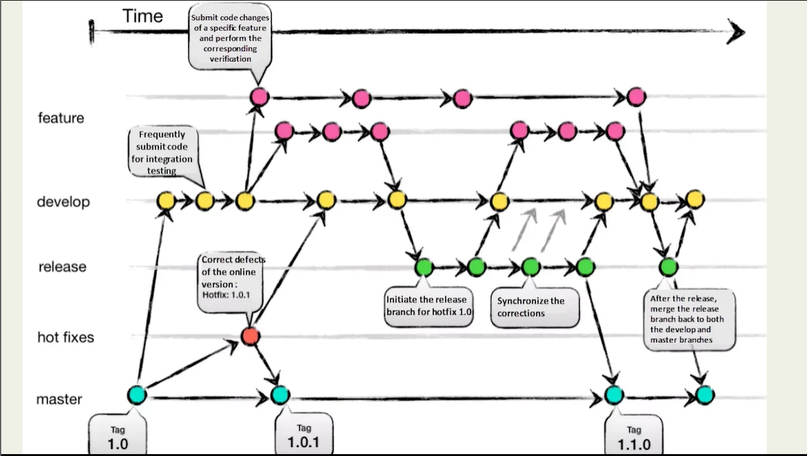

Git 几乎是每个计算机相关专业学生都绕不开的工具。它最大的价值，不只是“保存代码”，而是帮助我们记录修改历史、管理版本、多人协作，以及在出问题时快速回退。

很多人刚开始学 Git 时，最容易陷入一种状态：命令记了不少，但还是不知道每一步到底在干什么。比如：

- 为什么有时候要先 `add` 再 `commit`？
- `modified` 和 `untracked` 到底有什么区别？
- 推送到 GitHub 时，为什么还要区分本地仓库和远程仓库？
- 分支到底是“高级功能”还是日常开发必备？

所以这篇文章不打算把 Git 的所有命令都堆给你，而是只整理一条最常用、最基础的 Git 工作流。目标不是“背命令”，而是先把 Git 的主线理解清楚。

## 1. Git 到底在解决什么问题

在没有 Git 的时候，我们经常会这样管理项目：

- `final`
- `final2`
- `final_真的最终版`
- `final_不要动`

这种方式最大的问题是：

- 很难知道每次修改了什么
- 出错后不容易回退
- 多人协作时容易互相覆盖
- 新功能和修 bug 混在一起，不方便管理

本质上，Git 解决的是“变化管理”的问题。  
它不是单纯地保存某个最终版本，而是在记录一个项目是如何一步步变成现在这个样子的。

理解这一点之后，你会发现 Git 的很多命令，其实都是围绕“记录变化”这件事展开的。

## 2. Git 的基本工作流程

可以先记住 Git 最常见的四步：

1. 修改文件
2. `git add`
3. `git commit`
4. `git push`

也就是说：

- 你先写代码
- 把要提交的内容放进暂存区
- 生成一次提交记录
- 再把本地提交推送到远程仓库

可以把它粗略理解成：

- 工作区：你正在修改的文件
- 暂存区：你准备提交的修改
- 本地仓库：已经正式保存下来的历史记录
- 远程仓库：同步到 GitHub 之类平台上的版本

只要这几个层次不混，Git 基本就不会太难。

## 3. 创建本地仓库

在一个项目目录下执行：

```bash
git init
```

这条命令会把当前目录初始化为一个 Git 仓库。初始化之后，这个目录里的文件就可以被 Git 管理了。

如果你是基于已有远程项目开始开发，更常见的方式是：

```bash
git clone 仓库地址
```

`git clone` 会把远程仓库完整下载到本地，并自动帮你建立好关联。

如果你是自己从零开始做项目，通常先 `git init`；  
如果你是接手已有项目，通常直接 `git clone`。

## 4. 文件状态要怎么理解

这是初学 Git 最容易混乱的地方。

一个文件通常会经历这几种状态：

### 1. 未跟踪（untracked）

新建但还没有被 Git 管理的文件，属于未跟踪状态。

这时可以用：

```bash
git add 文件名
```

把它加入暂存区。

### 2. 已修改（modified）

一个已经被 Git 管理过的文件，在你再次修改后，会进入“已修改”状态。

注意：  
“已修改”不等于“未跟踪”。它说明 Git 知道这个文件，只是你改了但还没暂存。

### 3. 已暂存（staged）

执行下面这条命令后，文件会进入暂存区：

```bash
git add 文件名
```

暂存区可以理解成：“这次提交我打算带上哪些修改”。

这个概念很重要，因为 `commit` 并不是“把当前所有文件一股脑提交”，而是“提交暂存区里的内容”。

如果你想取消暂存，可以用：

```bash
git restore --staged 文件名
```

旧写法也常见：

```bash
git reset HEAD 文件名
```

### 4. 已提交（committed）

当你执行：

```bash
git commit -m "本次修改说明"
```

就会生成一次提交记录。此时暂存区中的内容会被正式写入 Git 历史。

所以从这个角度看：

- `git add` 是“挑选这次要提交什么”
- `git commit` 是“正式记录一次变化”

## 5. 常见查看命令

### 查看当前状态

```bash
git status
```

这是最常用的命令之一。它会告诉你：

- 当前在哪个分支
- 哪些文件被修改了
- 哪些文件已经暂存
- 哪些文件还未被跟踪

### 查看具体改动

```bash
git diff
```

这个命令用于查看“工作区和暂存区”的差异。

如果你想看“已暂存但还没提交”的差异，可以用：

```bash
git diff --cached
```

### 查看提交历史

```bash
git log
```

它可以查看历史提交记录。

如果你只想看更简洁的版本，可以用：

```bash
git log --oneline
```

建议初学时把 `git status` 和 `git log --oneline` 用熟，这两个命令能解决大部分“我现在到底在哪一步”的困惑。

## 6. 删除文件时要注意什么

### 物理删除并记录到 Git

```bash
git rm 文件名
```

这会：

- 删除工作区中的文件
- 同时把这次删除加入暂存区

### 只取消 Git 跟踪，但保留本地文件

```bash
git rm --cached 文件名
```

这个命令常用于：

- 某个文件不想再提交到仓库
- 你准备把它加入 `.gitignore`

比如某些缓存文件、配置文件、构建产物等。

## 7. 如何回退提交

如果刚刚提交了，但想撤回，可以用：

```bash
git reset --soft HEAD~1
```

它的意思是：

- 撤销最近一次提交
- 但保留代码修改
- 并且仍然保留在暂存区

如果你想撤销提交，但保留修改到工作区，不保留暂存状态，可以用：

```bash
git reset --mixed HEAD~1
```

不建议初学者一开始就频繁使用 `--hard`，因为它会直接丢掉改动。

如果你现在还不太能区分 `soft / mixed / hard`，没关系。先记住最安全的一条：

- 想撤销最近一次提交，但不想丢代码，优先考虑 `git reset --soft HEAD~1`

## 8. 连接远程仓库

如果你已经在 GitHub 上创建了一个空仓库，可以把本地仓库和远程仓库连起来：

```bash
git remote add origin 仓库地址
```

这里的 `origin` 只是远程仓库的默认名字，你也可以取别的名字，但绝大多数人都用 `origin`。

你可以用下面命令查看当前远程仓库：

```bash
git remote -v
```

你可以把本地仓库理解成“你自己电脑上的版本历史”，把远程仓库理解成“放在 GitHub 上、可以备份和协作的版本历史”。

## 9. 第一次推送到 GitHub

现在 GitHub 上新建仓库时，默认主分支通常是 `main`，不再是早年的 `master`。

如果你想把本地主分支改成 `main`，可以这样做：

```bash
git branch -M main
```

然后第一次推送：

```bash
git push -u origin main
```

这里的 `-u` 表示把本地分支和远程分支建立跟踪关系。  
之后你通常只需要：

```bash
git push
```

就够了。

第一次推送时，如果需要登录或授权，按照提示完成即可。

以后最常见的日常操作其实就是：

```bash
git add .
git commit -m "本次修改说明"
git push
```

所以真正需要练熟的不是“所有命令”，而是这三步。

## 10. 分支是干什么的

分支可以理解为“从当前版本分出一条新的开发线”。

这样做的好处是：

- 新功能开发不会影响主分支
- 修 bug 时更安全
- 多人协作时更清晰

很多人一开始会觉得分支像是“高级功能”，但实际上它非常日常。  
哪怕只有你一个人开发，只要功能稍微复杂一点，分支都会让你的工作更稳。

下面这张图可以帮助理解分支和合并：



一般来说：

- `main` 用来放相对稳定的版本
- 新功能在新分支上开发
- 测试没问题后再合并回主分支

这也是为什么很多团队都会约定：

- 主分支尽量保持可运行
- 每个功能单独开分支
- 合并前先测试

## 11. 分支常用命令

### 查看分支

```bash
git branch
```

当前分支前面会有一个 `*` 号。

### 创建分支

```bash
git branch 分支名
```

### 切换分支

```bash
git checkout 分支名
```

更现代一点的写法是：

```bash
git switch 分支名
```

### 创建并切换到新分支

```bash
git checkout -b 分支名
```

或者：

```bash
git switch -c 分支名
```

### 合并分支

比如当前在 `main` 分支，想把 `feature-login` 合并进来：

```bash
git merge feature-login
```

如果你刚开始学 Git，可以先把 `branch`、`switch`、`merge` 这三类命令理解为：

- `branch`：创建或查看开发线
- `switch` / `checkout`：切换开发线
- `merge`：把一条开发线的成果合并回来

## 12. 什么是冲突

如果两个分支都修改了同一个文件的同一部分内容，合并时就可能出现冲突（merge conflict）。

这时 Git 无法替你判断该保留哪一份内容，就需要你手动处理。

通常做法是：

1. 打开冲突文件
2. 找到 Git 标出的冲突区域
3. 保留你真正需要的内容
4. 删除冲突标记
5. 再次 `git add`
6. 完成合并提交

所以“解决冲突”本质上就是：手动决定最终保留什么版本。

初学时不要把冲突想得太可怕。大多数时候，它不是 Git 坏了，而只是 Git 不知道你到底更想保留哪一份修改。

## 13. 临时保存修改：stash

一个很常见的场景是：

- 你在当前分支开发到一半
- 还不想提交
- 但突然需要切去别的分支修 bug

这时可以先把当前改动临时存起来：

```bash
git stash
```

回来后再恢复：

```bash
git stash apply
```

如果你想看当前 stash 列表：

```bash
git stash list
```

如果你能理解 `stash`，其实就是理解了：  
“Git 不只有提交一种保存方式，它还提供了临时搁置工作区改动的手段。”

## 14. 最后记住这一套最常用流程

对于初学者来说，先把下面这套流程练熟就够用了：

```bash
git init
git add .
git commit -m "first commit"
git branch -M main
git remote add origin 仓库地址
git push -u origin main
```

之后日常更新通常就是：

```bash
git add .
git commit -m "本次修改说明"
git push
```

## 总结

Git 入门时最重要的，不是一次记住所有命令，而是先建立这几个核心概念：

- Git 在记录“变化历史”
- `git add` 是把内容放进暂存区
- `git commit` 是生成一次历史记录
- `git push` 是把本地提交发到远程仓库
- 分支是为了更安全地开发和协作

当你把这条主线理解清楚后，再去学 stash、rebase、cherry-pick、reset 等进阶内容，就会顺很多。

如果你现在还是 Git 新手，我的建议是：  
先不要追求“一口气学完”，而是先把这篇文章里的这一条基础工作流跑顺。只要你能熟练完成一次 `init / add / commit / push / branch / merge`，Git 的门就算真正入了。
